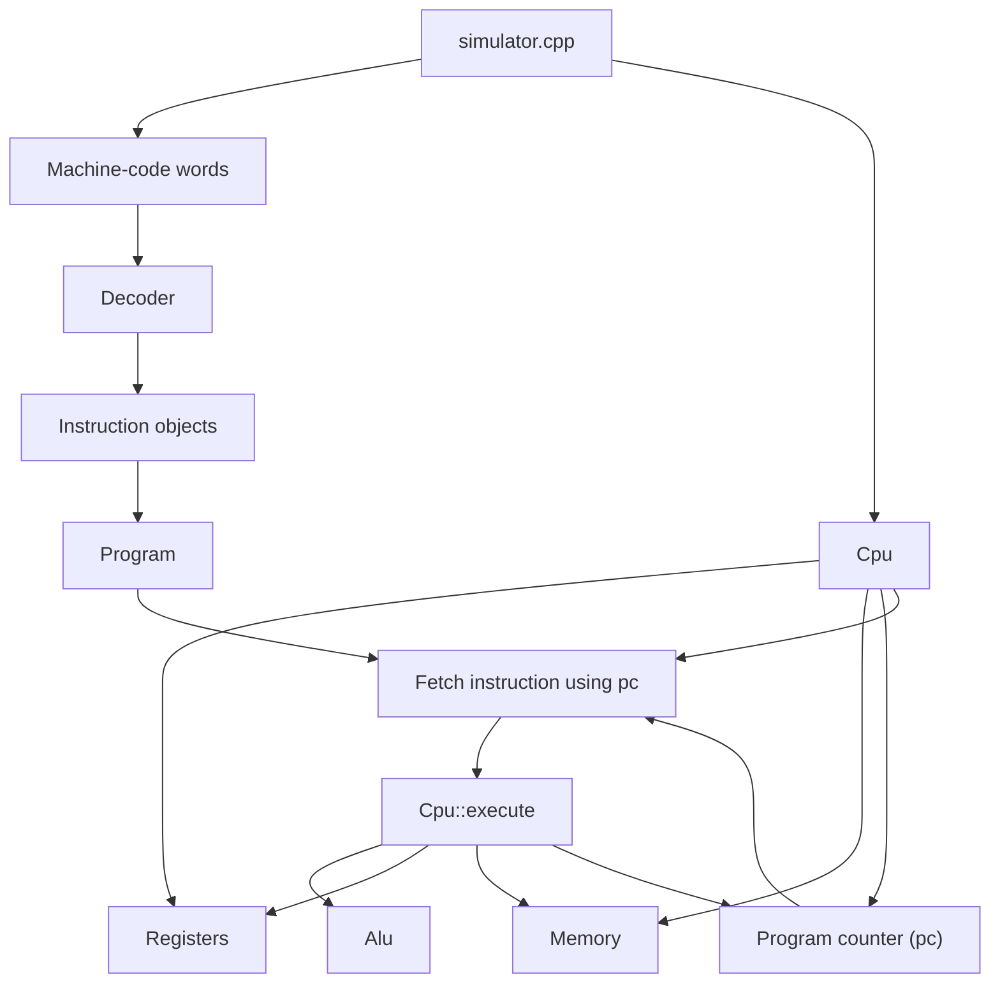

# RISC-V-simulation
Simulating RISC-V in C++ for my better understanding of c++ and computer architecture.

## Current structure

- `simulator.cpp` starts the simulator and connects the parts together.
- `alu/` contains arithmetic operations.
- `cpu/` contains CPU state and execution behavior.
- `decoder/` contains machine-code decoding for the supported RV32I subset.
- `instruction/` contains the internal instruction model.
- `memory/` contains simulated byte-addressed memory.
- `program/` contains instruction storage and fetch by address.
- `register/` contains the register file.
- `Makefile` builds and runs the project with simple commands.

## Execution flow



## CPU notes

- The CPU owns the register file.
- The CPU owns simulated memory.
- The CPU also stores the program counter, usually called `pc`.
- In RV32I, normal instructions are 4 bytes, so the default `pc` step is `pc += 4`.
- The CPU asks the ALU to perform arithmetic, then writes the result back to a register.

## Instruction notes

- An instruction describes one operation the CPU should perform.
- `addi` uses a signed immediate, so values like `-5` are allowed.
- The decoder turns real machine-code bits into this instruction structure.

## Decoder notes

- The decoder currently supports `add`, `sub`, `addi`, `and`, `or`, `xor`, `andi`, `ori`, `xori`, `lw`, `sw`, `beq`, `bne`, `jal`, and `jalr`.
- `add` and `sub` are R-type instructions.
- `addi` is an I-type instruction with a signed 12-bit immediate.
- `and`, `or`, and `xor` are R-type logical instructions.
- `andi`, `ori`, and `xori` are I-type logical instructions.
- `lw` is an I-type load instruction, and `sw` is an S-type store instruction.
- `beq` and `bne` are B-type branch instructions with signed offsets.
- `jal` is a J-type jump instruction that stores `pc + 4` in `rd`.
- `jalr` is an I-type register jump that computes its target from `rs1 + immediate`.
- Unsupported instruction words throw an error for now.

## Memory notes

- Memory is byte-addressed, meaning each address points to one byte.
- `lw` loads 4 bytes from memory into a register.
- `sw` stores 4 bytes from a register into memory.
- For now, word addresses must be divisible by 4.

## Program notes

- A program is a list of instructions stored in order.
- The CPU uses `pc` as an address, so instruction `0` is at address `0`, instruction `1` is at address `4`, instruction `2` is at address `8`, and so on.
- `Cpu::run(...)` keeps fetching and executing instructions until there is no instruction at the current `pc`.
- Passing `true` to `Cpu::run(program, true)` enables a trace that prints each fetched instruction and its effect.

## ALU notes

- ALU means arithmetic logic unit.
- For now, this project supports arithmetic and basic bitwise logic.

## Register file notes

- RV32I has 32 integer registers: `x0` to `x31`.
- `x0` is hardwired to zero, so writes to `x0` are ignored.
- Registers also have ABI names, such as `zero`, `ra`, `sp`, `a0`, and `t0`.

## Build and run

```bash
make
make run
```

To remove generated build files:

```bash
make clean
```
