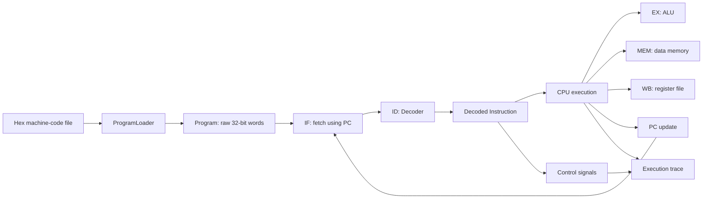

# RISC-V RV32I Simulator

A modular C++17 simulator for a learning-focused subset of the RISC-V RV32I
instruction set architecture. The project models instruction loading, fetch,
decode, execution, memory access, register write-back, and program-counter
updates using a single-cycle execution model.

> **Project status:** The single-cycle simulator is functional for the
> instructions listed below. A pipelined CPU model is planned as a separate
> implementation.

## Features

- Loads 32-bit machine-code words from a hexadecimal text file.
- Decodes R-, I-, S-, B-, and J-type instruction formats at runtime.
- Models all 32 RV32I integer registers, including the hardwired `x0` register.
- Provides a byte-addressed memory with aligned 32-bit word reads and writes.
- Executes arithmetic, logical, memory, branch, and jump instructions.
- Generates single-cycle control signals for each supported operation.
- Prints an `IF`, `ID`, `EX`, `MEM`, and `WB` execution trace.
- Reports invalid input files and unsupported instructions through the driver.

## Supported Instructions

| Category | Instructions |
| --- | --- |
| Arithmetic | `add`, `sub`, `addi` |
| Logical | `and`, `or`, `xor`, `andi`, `ori`, `xori` |
| Memory | `lw`, `sw` |
| Branch | `beq`, `bne` |
| Jump | `jal`, `jalr` |

## Architecture



The `Program` stores raw machine-code words. During execution, the CPU fetches
one word using the program counter and passes it to the decoder. The CPU
dispatches the resulting instruction to the appropriate ALU, memory, register,
and PC behavior. The control unit generates the corresponding datapath signals
for the execution trace.

This is currently a sequential single-cycle model: one instruction completes
all five logical stages before the next instruction is fetched. The stage trace
describes datapath activity; it does not yet represent overlapping pipeline
stages.

## Project Structure

```text
.
|-- alu/           Arithmetic and bitwise operations
|-- control/       Control-signal generation
|-- cpu/           CPU state, execution, and tracing
|-- decoder/       RV32I machine-code decoding
|-- examples/      Example hexadecimal programs
|-- instruction/   Internal decoded-instruction model
|-- loader/        Machine-code file loading and validation
|-- memory/        Byte-addressed data memory
|-- program/       Raw instruction storage and PC-based fetch
|-- register/      RV32I integer register file
|-- driver.cpp     Command-line entry point and orchestration
`-- Makefile       Build and run commands
```

## Building

### Requirements

- A C++17-compatible compiler (`clang++` is used by the Makefile)
- GNU Make

Build the simulator from the project root:

```bash
make
```

The executable is created at `build/simulator`.

## Running

Run the bundled example program:

```bash
make run
```

Run a different program through Make:

```bash
make run PROGRAM=path/to/program.txt
```

Or invoke the executable directly:

```bash
./build/simulator examples/basic_program.txt
```

Remove generated build files with:

```bash
make clean
```

## Program Input Format

Input files contain one hexadecimal 32-bit instruction per non-empty line:

```text
002081b3
40110233
06408293
```

Instructions are stored from address `0` onward in 4-byte steps. Blank lines
are ignored. Any other text on an instruction line is currently rejected.

The bundled driver initializes `x1` to `10`, `x2` to `20`, and `x7` to `100`
before execution so that `examples/basic_program.txt` can demonstrate register
arithmetic and memory access.

## Execution Trace

Trace output shows the work performed for every instruction:

```text
pc 0: add x3, x1, x2
  IF: fetch instruction at pc 0
  ID: decode add x3, x1, x2
  CTRL: RegWrite=1 MemRead=0 MemWrite=0 Branch=0 Jump=0 ALUSrc=reg ALU=ADD WB=ALU
  EX: x1(10) + x2(20) = 30
  MEM: no memory access
  WB: x3 = 30
  PC: pc -> 4
```

After execution, the simulator prints the final program counter and all integer
register values using both architectural and ABI register names.

## Current Limitations

- The simulator implements a subset of RV32I rather than the complete ISA.
- Pipeline overlap, forwarding, stalls, and hazard handling are not implemented.
- Control signals are exposed for tracing; execution is currently dispatched by
  the CPU's instruction-operation logic.
- The CPU currently uses the default 1024-byte data memory.
- `lw` and `sw` require addresses aligned to 4-byte boundaries.
- The input format accepts hexadecimal machine code, not assembly source or ELF
  binaries.

## Roadmap

- Add explicit pipeline registers: `IF/ID`, `ID/EX`, `EX/MEM`, and `MEM/WB`.
- Introduce a separate pipelined CPU while retaining the single-cycle model as a
  reference implementation.
- Add data-hazard detection, stalls, forwarding, and control-hazard flushing.
- Expand instruction coverage toward the complete RV32I base instruction set.
- Add automated unit and integration tests.

## Purpose

This project is being developed to study how RISC-V machine instructions move
through a CPU and to practice modular C++ design. It prioritizes clear component
boundaries and observable execution behavior over cycle-accurate hardware
simulation.
